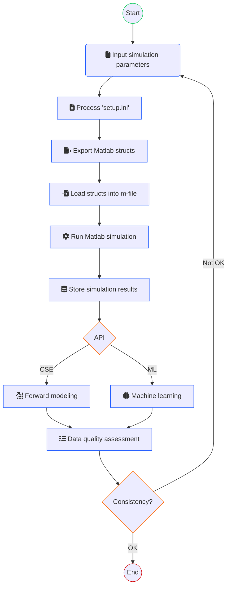

# About PUMLE


PUMLE (a quibble for "plume") is a project under the [CO2SS Project](https://co2ssproject.com) by the [TRIL Lab](http://www.tril.ci.ufpb.br) / CCS Team. Its primary goals are to:

- **Produce simulation data** related to plume migration from numerical simulations generated by MRST software.
- **Feed physics-informed machine learning experiments** with high-quality, consistent datasets.
- **Build an end-to-end ingestion/consumption data engineering pipeline** for geological carbon storage applications in Brazilian reservoirs.

PUMLE consolidates simulation outputs, processes them into multidimensional (5D) arrays, and offers the ability to export data in various formats (NumPy, Zarr, MAT-files, CSV) as well as upload final results to cloud storage.

---

## Process Overview

This flowchart summarizes PUMLE's purpose and high-level workflow:



---

## Features

- **Parameter Variation & Caching:**  
  Generate multiple simulation parameter combinations and cache them to avoid redundant simulation runs.

- **Simulation Management:**  
  Integrate with MRST software via MATLAB scripts to execute numerical simulations and process simulation outputs.

- **Data Consolidation:**  
  Consolidate simulation outputs into multidimensional arrays, transform them into a unified “golden” dataset, and support different output formats (NumPy, Zarr, MAT-files, CSV).

- **Cloud Storage Integration:**  
  Optionally upload consolidated outputs to cloud storage (e.g., Amazon S3) using built-in S3 upload functionality.

- **Metadata Handling:**  
  Process, validate, and export simulation metadata (bronze, silver, and golden layers) using Pandas and Pandera.

- **Tabular Conversion:**  
  Transform high-dimensional simulation data into tabular (CSV) format for further analysis or consumption by downstream applications.

---

## Installation

PUMLE is organized as a Python package and is installable via pip. To install the package (once published on PyPI), run:

```bash
pip install pumle
```

Alternatively, if you are developing or using it locally, clone the repository and install with:

```bash
pip install .
```

Additionally, create a conda environment using the provided environment file:

```bash
conda env create -f environment.yml -n pumle-env
conda activate pumle-env
```

---

## Usage

A typical workflow involves configuring the pipeline via a configuration dictionary or `setup.ini` file, then running the pipeline to process simulation parameters, execute simulations, consolidate results, and (optionally) upload to cloud storage.

Here’s an example script demonstrating usage:

```sh
python main.py
```
This example shows that after installation, a user simply imports the `Pumle` class from your package, configures it, and runs the pipeline. The caching in the parameter variation module ensures that simulations with previously run parameter combinations are skipped.

---

## Development & Contributing

### Project Structure

```
pumle_project/
├── setup.py
├── pyproject.toml       # Optional: for modern packaging standards
├── README.md
├── LICENSE
├── requirements.txt
├── MANIFEST.in          # Optional: include additional files
└── src/
    └── pumle/           # Your package code
        ├── __init__.py  # Contains __version__ and key imports
        ├── arrays.py
        ├── cloud_storage.py
        ├── ini.py
        ├── mat_files.py
        ├── metadata.py
        ├── parameters.py
        ├── parameters_variation.py
        ├── paths.py
        ├── sim_results_parser.py
        ├── tabular.py
        └── utils.py
```

## License

PUMLE is released under the [MIT License](LICENSE).

---

## Acknowledgements

- **CO2SS Project** – For inspiring the simulation use case.
- **TRIL Lab / CCS Team** – For the foundational research and development.
- **Contributors:** Gustavo Oliveira, Luiz Fernando Santos, Samuel Mendes

---

## Remarks

- **Environment Configuration:**  
  Modify the prefix in `environment.yml` as needed for your local setup.
- **Further Documentation:**  
  Refer to the [GLOSSARY.md](GLOSSARY.md) for detailed descriptions of configuration parameters.
