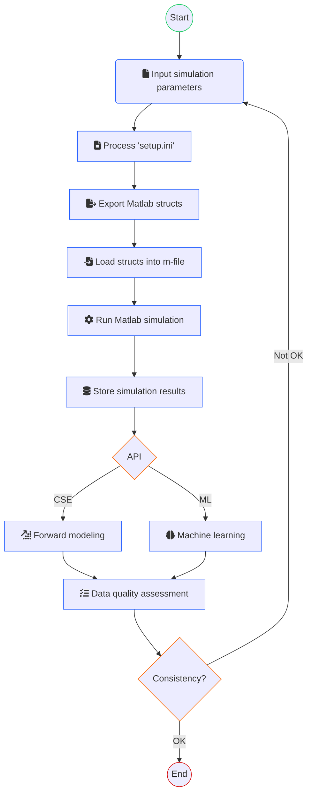

# About PUMLE


PUMLE (as a quibble for "plume") is a project under the [CO2SS Project](https://co2ssproject.com) by [TRIL Lab](http://www.tril.ci.ufpb.br) / CCS Team intended to:

- produce data related to plume migration from numerical simulations outputed by MRST software;
- feed (physics-informed) machine learning experiments;
- build a ingestion/consumption data engineering pipeline for geological carbon storage applications in Brazilian reservoirs;

## Process overview

This flowchart summarizes PUMLE's purpose:



## Developers

- Gustavo Oliveira
- Luiz Fernando Santos
- Samuel Mendes

## Remarks

- Modify prefix in `environment.yml`.

## Setup

Run the coomands below to create and activate the environment.


```sh
conda env create -f environment.yml -n pumle-env
conda activate pumle-env
``` 

